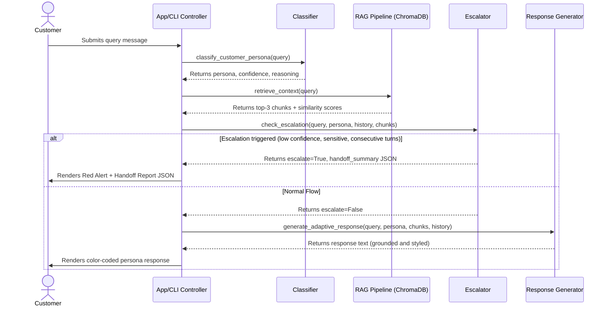

# Adsparkx AI: Persona-Adaptive Customer Support Agent

An intelligent customer support agent capable of detecting customer personas (Technical Expert, Frustrated User, Business Executive), retrieving grounded context from a local knowledge base (RAG using ChromaDB), and adapting its response style and tone dynamically. It automatically detects escalation triggers (billing issues, user frustration, low confidence retrieval) and outputs structured handoff reports.

---

## 1. Project Overview

Adsparkx AI Support Agent solves the challenge of generic customer interactions. Customer support messages vary in tone and expectation. An engineer wants root cause details and code; a frustrated client wants empathy and quick solutions; an executive wants brief operational summaries and timelines. 

This agent uses a unified pipeline to parse incoming requests, classify user communication personas, query a custom-built support database, and dynamically compile custom instructions. If it cannot solve the query, it generates a structured human handoff JSON.

---

## 2. Tech Stack

| Component | Library / Tool | Version | Purpose |
| --- | --- | --- | --- |
| **Language** | Python | `3.13.5` (>=3.11) | Core runtime environment |
| **LLM & Embeddings** | `google-genai` | `>=0.1.0` | Client library for Gemini 2.5 Flash and text-embedding-004 |
| **Vector Database** | `chromadb` | `>=0.4.0` | Local database for vector indexing and cosine search |
| **PDF Extraction** | `pypdf` | `>=3.0.0` | Native PDF reading and text extraction page-by-page |
| **PDF Generation** | `reportlab` | `>=4.0.0` | Programmatic PDF creation for sample security documents |
| **Orchestration & Split** | `langchain-text-splitters`| `>=0.1.0` | Chunk splitter for support articles |
| **Web Interface** | `streamlit` | `>=1.30.0` | Premium dark-mode dashboard interface |
| **Configuration** | `python-dotenv` | `>=1.0.0` | local variable loading and environment configuration |
| **CLI Styling** | `colorama` | `>=0.4.6` | ANSI color escape sequences for console readability |

---

## 3. System Architecture

### Architectural Diagram

```text
              [Customer Query Message]
                         │
                         ▼
        ┌──────────────────────────────────┐
        │  Persona Detection Classifier    │
        │  (LLM Zero-Shot / Rule Fallback) │
        └────────────────┬─────────────────┘
                         │
                  (Persona Tag)
                         │
                         ▼
        ┌──────────────────────────────────┐
        │       RAG Retrieval Pipeline     │
        │    (ChromaDB Cosine Search)      │
        └────────────────┬─────────────────┘
                         │
                 (Top-K Chunks + Scores)
                         │
                         ├─────────────────────────────────────────┐
                         ▼                                         ▼
        ┌──────────────────────────────────┐    ┌──────────────────────────────────┐
        │        Escalation check          │    │    Adaptive Response Generator   │
        │ (Confidence, Sensitive, Turns)   │    │  (Prompt Compiler & LLM Call)   │
        └────────────────┬─────────────────┘    └──────────────────┬───────────────┘
                         │                                         │
               (Escalation Triggered)                      (Normal Flow)
                         │                                         │
                         ▼                                         ▼
        ┌──────────────────────────────────┐    ┌──────────────────────────────────┐
        │     Human Handoff Generator      │    │    Grounded Persona Response     │
        │    (JSON Diagnostic Summary)     │    │   (System engineer, Care, Exec)  │
        └──────────────────────────────────┘    └──────────────────────────────────┘
```

### Flow Sequence (Mermaid)



---

## 4. Persona Detection Strategy

The classification maps the conversational semantic footprint of the text into discrete classes:
$$\text{Persona} \in \{\text{"Technical Expert"}, \text{"Frustrated User"}, \text{"Business Executive"}\}$$

### Classification Method
We implement a **hybrid classification engine**:
1. **LLM Classifier (Default):** Passes the user message to Gemini (`gemini-2.5-flash`) with structured instructions and details of the three target personas. Uses Gemini **Structured Outputs** (`response_schema`) to guarantee a reliable JSON payload.
2. **Rule-Based Fallback (Offline Mode):** If the API key is missing or the call fails, a rule-based engine computes keyword and syntax scores:
   - **Technical Expert:** Spotting keywords like `api`, `headers`, `json`, `token`, `payload`, `status code`, `webhook`.
   - **Frustrated User:** Score increased by exclamation marks (`!`), CAPS LOCK words, and complaints (e.g. `broken`, `refund`, `terrible`, `waiting for hours`).
   - **Business Executive:** Focuses on brevity, business outcomes, timelines, pricing, SLAs (e.g. `roi`, `uptime`, `contract`, `operational impact`).

---

## 5. RAG Pipeline Design

### Chunking Strategy
Support files are parsed programmatically (PDFs use `pypdf` page extraction; MD and TXT use native character streams). The content is partitioned into chunks using a `RecursiveCharacterTextSplitter` with:
- **Chunk Size:** $400$ characters
- **Chunk Overlap:** $40$ characters
- Separator weights: paragraphs (`\n\n`), newlines (`\n`), sentences (`. `), words (` `).

### Embedding Model & Vector DB
- **Embedding:** We use Gemini's `text-embedding-004` (768 dimensions). If offline or API key is missing, it falls back to a local `sentence-transformers` model (`all-MiniLM-L6-v2`, 384 dimensions), which downloads automatically on startup.
- **Vector Store:** ChromaDB (`PersistentClient`) stores chunks, embeddings, and metadata (source document name, chunk index, page number for PDF).
- **Retrieval Metric:** Cosine similarity is computed between query vector $Q$ and document chunk vector $D$:
  $$\text{Similarity}(Q, D) = \frac{Q \cdot D}{\|Q\| \|D\|}$$
  ChromaDB calculates cosine distance. Similarity is computed as:
  $$\text{Similarity} = 1.0 - \text{Distance}$$
  Chunks are filtered using a similarity threshold and the top $K=3$ matches are retrieved.

---

## 6. Escalation Logic

The conversation is automatically escalated when any of the following configurable criteria are met:

1. **Low Retrieval Confidence:** If the similarity score of the best chunk falls below the threshold (default: $0.40$), indicating the knowledge base does not cover the question.
2. **Missing Information:** Zero matching documents are returned.
3. **Sensitive Keywords:** Detection of billing dispute terms (`refund`, `chargeback`, `duplicate charge`), legal threats (`sue`, `lawyer`, `court`), fraud, or account closure instructions.
4. **Consecutive Frustration:** If the user exhibits unresolved frustration (`Frustrated User` persona) across $3+$ consecutive turns.
5. **Direct Request:** If the user explicitly asks for a human agent (`speak to a manager`, `live agent`, `transfer me`).

### Human Handoff Report Structure
Upon escalation, a structured JSON document is output to the console and web dashboard:
```json
{
  "escalation_reason": "Low similarity score/Sensitive issue...",
  "customer_persona": "Frustrated User",
  "core_issue_summary": "User query summary",
  "retrieved_documents_used": ["billing_policy.txt"],
  "highest_retrieved_similarity": 0.35,
  "actions_attempted_by_user": ["User actions from history"],
  "recommended_next_steps": ["Review transaction logs", "Verify status"],
  "conversation_transcript": ["Transcript turns"]
}
```

---

## 7. Installation & Setup

### Prerequisites
- Python 3.11 or higher (Python 3.13 tested and fully supported).

### Step-by-Step Installation

1. **Clone the Repository:**
   ```bash
   git clone <repo_url>
   cd persona-support-agent
   ```

2. **Create and Activate a Virtual Environment:**
   ```bash
   python -m venv venv
   # On Windows (cmd):
   venv\Scripts\activate
   # On macOS/Linux:
   source venv/bin/activate
   ```

3. **Install Dependencies:**
   ```bash
   pip install -r requirements.txt
   # Install text-splitters wrapper
   pip install langchain-text-splitters
   ```

4. **Set Up Environment Variables:**
   Open the `.env` file at the project root:
   ```env
   GEMINI_API_KEY="your_actual_gemini_api_key"
   ```
   Configure your Gemini API key in the file.
   *Note: If no API key is specified, the application will automatically activate the local offline fallback (SentenceTransformers for embeddings and rule-based template generation).*

5. **Generate Support Data & Index Database:**
   Run the data generator and database indexing script:
   ```bash
   python scripts/generate_data.py
   python src/rag_pipeline.py
   ```

---

## 8. Run Instructions

### 1. Run Interactive CLI Chatbot
Start the CLI chatbot in your console:
```bash
python cli.py
```
- Converse with the agent. The terminal will output detected personas, similarity scores, retrieved sources, and escalation summaries.
- Type `exit` or `quit` to exit.

### 2. Run Streamlit Web Application
Launch the web dashboard in your browser:
```bash
streamlit run app.py
```
- Open the local URL (usually `http://localhost:8501`).
- The interface features a wide split-screen view: chat interface on the left and live diagnostic panel on the right.
- Adjust sliders in the sidebar to test different thresholds.

---

## 9. Verification & Test Scenarios

Run the unit tests to verify system stability:
```bash
python -m unittest tests/test_agent.py
```

### Standard Test Queries

| # | Input Query | Persona | System Behavior |
| --- | --- | --- | --- |
| **1** | *"What are the header parameter requirements for your bearer token auth implementation?"* | **Technical Expert** | Identifies API key instructions and outputs formatted code snippets, headers, and HTTP codes from `api_troubleshooting.md`. |
| **2** | *"Where is the guide to clear cookies? It's been an hour and nothing is loading on your interface!"* | **Frustrated User** | Empathizes with the delay, uses simple bullet points, avoids technical terms, and reads from `password_reset_guide.pdf`. |
| **3** | *"Our operational uptime is decreasing. We need a timeline of when billing disputes are resolved."* | **Business Executive** | Focuses on direct business outcomes, SLAs, and resolution times from `billing_policy.txt`. |
| **4** | *"I'm experiencing an issue with your database integration that's causing internal errors."* | **Technical Expert** | Retrieves matching RAG context. |
| **5** | *"My billing statement has unexpected duplicate charges. I demand an immediate refund!"* | **Frustrated User** | **Escalates immediately** due to sensitive billing keywords. Renders handoff report JSON. |

---

## 10. Known Limitations & Future Improvements

1. **Offline Response Limits:** Under the offline fallback mode, response generation relies on pre-defined templates containing the retrieved context, rather than real-time LLM reasoning.
2. **State Persistence:** Conversational history and ChromaDB settings are stored locally. Production builds would benefit from cloud vector stores (like Qdrant or Pinecone) and database storage (SQLite/PostgreSQL) for session memory.
3. **Sentiment Model Precision:** Currently, sentiment analysis relies on keyword rules. Adding a lightweight local sentiment model (like DistilBERT) would improve user frustration detection.
